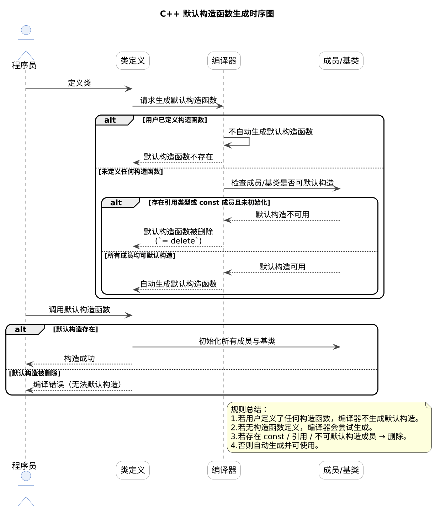
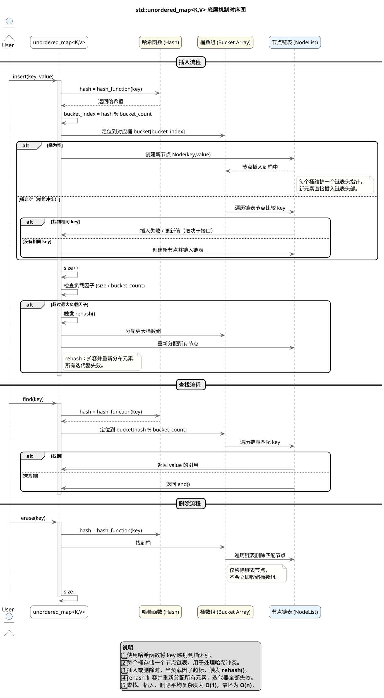

# C/C++面试通用攻略 - 题目目录

## C/C++语言相关，常见题型
*   **如何避免野指针**
*   **malloc free和new delete的区别**
*   **extern 关键字作用**
*   **简述 strcpy、sprintf 与 memcpy 的区别**
*   **c/c++ 中强制类型转换使用场景？**
*   **c++ 什么时候生成默认构造函数**

*   **c++ 什么时候生成默认拷贝构造函数**
*   **c++ 什么是深拷贝，什么是浅拷贝**

## C/C++标准库，常见题型
*   **vector 底层实现原理**

1. **连续内存模型**
   `std::vector` 内部维护一个指向堆内存的指针 `_data`，以及 `_size`（当前元素数）和 `_capacity`（已分配容量）。所有元素存储在连续内存中，保证随机访问的常数时间复杂度。

2. **动态扩容机制**
   当 `push_back()` 插入新元素时：

   * 若 `_size < _capacity`，直接在现有内存中构造新元素；
   * 若容量不足，则**分配更大内存（通常为 2 倍）**，再将旧元素移动或拷贝过去，最后释放旧内存。
     扩容会导致迭代器、引用、指针失效。

3. **内存管理与 RAII**
   元素的构造、析构由 `vector` 自动管理。离开作用域时，析构函数会依次销毁所有元素并释放堆内存，符合 RAII 原则。

4. **容量与大小控制**

   * `reserve(n)`：仅修改容量，预留空间以避免频繁扩容。
   * `resize(n)`：调整逻辑大小，大于当前 size 则构造新元素，小于则析构多余部分。
   * `shrink_to_fit()`：尝试收缩容量以减少内存占用。

5. **元素访问与边界检查**

   * `operator[]` 直接访问元素，**无边界检查**；
   * `at()` 提供检查，越界时抛出 `std::out_of_range` 异常。

6. **清空与回收策略**

   * `clear()` / `pop_back()` 仅析构元素但不释放内存。
   * 再次插入时可直接复用已分配的空间。

---

*   **vector 内存增长机制**
*   **vector中reserve和resize的区别**
*   **vector 的元素类型为什么不能是引用**
*   **list 极速底层实现原理**
*   **deque 底层实现原理**
*   **什么时候使用vector list deque**
*   **priority_queue 的底层实现原理**
*   **multiset 的底层实现原理**
*   **unordered_map 的底层实现原理**

*   **迭代器底层实现原理？及其有哪些种类？**
*   **迭代器失效？连续和非连续存储容器的失效？**
*   **STL 容器线程安全性**

## C++面对对象，常见题型
*   **面对对象的三大特征**
*   **简述多态实现原理**
*   **怎么解决菱形继承**
*   **关键字override,final的作用**
*   **c++ 类型推导用法**
*   **function,lambda,bind之间的关系**
*   **继承下的构造函数和析构函数执行顺序**
*   **虚函数表和虚函数表指针的创建时机**
*   **虚析构函数的作用**
*   **智能指针种类以及使用场景**
*   **c++11用过哪些特性？**
*   **动态库与静态库的区别？**
*   **左值引用与右值引用的区别？右值引用的意义？**

## 设计模式，常见题型
*   **面对对象中有哪些设计原则**
*   **简述开闭原则，哪些原则与它相关，分别是什么关系？**
*   **什么是里氏替换原则**
*   **什么是迪米特原则**
*   **什么是依赖倒置原则**
*   **单例模式多线程？**
*   **什么是工厂模式？什么是抽象工厂？应用场景是什么？**
*   **什么是代理模式？应用场景是什么？**
*   **什么是装饰器模式？应用场景是什么？**
*   **什么是组合模式，应用场景是什么？**
*   **什么是责任链模式？应用场景是什么？**
*   **什么是模板方法？应用场景是什么？**
*   **什么是策略模式？应用场景是什么？**
*   **什么是观察者模式？应用场景是什么？**

## 数据结构与算法，常见题型
*   **用两个栈实现队列**
*   **包含min函数的栈**
*   **队列的最大值**
*   **用一个栈实现另一个栈的排序**
*   **仅用递归和栈操作逆序一个栈**
*   **链表中倒数第 k 个节点**
*   **链表中环的入口节点**
*   **反转链表**
*   **从尾到头打印链表**
*   **两个链表的第一个公共节点**
*   **第一个只出现一次的字符**
*   **最长不含重复字符的子字符串**
*   **字符串的排列**
*   **反转字符串**
*   **把数字翻译成字符串**
*   **重建二叉树**
*   **二叉树的下一个节点**
*   **树的子结构**
*   **二叉树展开为链表**
*   **对称的二叉树**
*   **从上到下打印二叉树**
*   **序列化二叉树**
*   **二叉树节点间的最大距离**
*   **二叉树中和为某一值的路径**
*   **二叉树的最近公共祖先**
*   **剪绳子**
*   **二进制中1的个数**
*   **矩阵的最小路径和**
*   **换钱的方法数**
*   **换钱的最小货币数**
*   **最长公共子序列问题**
*   **最长公共子串问题**
*   **数组中的最长连续序列**
*   **最长递增子序列**
*   **子矩阵的最大累加和问题**

## 操作系统，进程线程，常见题型
*   **进程和线程的区别？**

*   **操作系统中进程与线程的切换过程**
*   **请描述系统调用整个流程**
*   **后台进程有什么特点**
*   **进程间通信有哪几种方式**
*   **操作系统中进程调度策略有哪几种**
*   **线程同步的方式**
*   **CAS是怎样的一种同步机制**
*   **CPU 是怎么执行指令的**
*   **用户态和内核态的区别**
*   **内存管理有哪几种方式**
*   **malloc 是如何分配内存的**
*   **页面置换算法有哪些**
*   **谈谈 cpu cache 一致性工作原理**
*   **写文件时进程宕机，数据会丢失吗**
*   **磁盘调度算法有哪些**

## 数据库/MySQL，常见题型
*   **数据库的三大范式**
*   **MySQL cpu 飙升，该怎么处理**
*   **如何定位以及优化 SQL 语句的性能问题**
*   **什么是视图,为什么使用视图**
*   **SQL语句在MySQL是如何执行的**
*   **索引在什么情况下会失效**
*   **MySQL 索引的目的和代价**
*   **主键索引和唯一索引的区别**
*   **聚集索引和辅助索引的区别**
*   **什么是覆盖索引,原理是什么**
*   **undolog和redolog有什么作用**
*   **什么是最左匹配规则，原理是什么**
*   **什么是索引下推，原理是什么**
*   **InnoDB 与 MyISAM 的区别**
*   **索引为什么要用B+树而不是二叉树或B树**
*   **数据库事务的四个特性以及含义**
*   **脏读、幻读、不可重复读出现的原因原理**
*   **不可重复读与幻读的区别**
*   **SQL注入原理，如何避免SQL注入**
*   **MySQL死锁问题产生的原因以及如何解决**
*   **MVCC 底层原理**

## 数据库/Redis，常见题型
*   **什么是 redis？redis 的应用场景有哪些？**
*   **redis 的对象类型以及底层实现的数据结构？**
*   **相同数量的数据hash与zset 存储占用情况？**
*   **基于 redis 实现限流功能，有哪几种方式？**
*   **redis为什么是单线程？为什么这么快？**
*   **redis 怎么实现分布式锁？有哪些缺陷？**
*   **redis怎么做高可用**
*   **redis不同持久化机制都有什么优缺点**
*   **什么是缓存雪崩、缓存穿透、缓存击穿**
*   **Redis淘汰策略有哪些**
*   **分析redis中的事务**

## 网络编程，常见题型
*   **简述 Reactor 网络编程模型**
*   **Reactor和Proactor的区别**
*   **连接断开有几种判定方式**
*   **接收客户端连接有几种方式**
*   **为什么用户态需要设置读写缓冲区**

## 网络原理，常见题型
*   **水平触发和边缘触发的区别**
*   **CLOSE_WAIT和TIME_WAIT是什么**
*   **TCP三次握手过程,为啥不可两次**
*   **TCP 四次挥手的过程**
*   **什么是连接半打开，半关闭状态**
*   **UDP和TCP的区别**
*   **描述输入网址到网页显示整个流程**
*   **linux系统如何收发网络包**
*   **TCP是如何保证可靠性的**
*   **什么是MTU、MSS以及为什么要有MSS**

## 分布式理论，常见题型
*   **什么是 CAP 理论**
*   **什么是 Base 理论**
*   **什么是2PC**
*   **什么是Raft协议，解决了什么问题**

## Kafka，常见题型
*   **kafka是什么？解决了什么问题？**
*   **zk对于kafka的作用是什么**
*   **kafka如何判断一个节点是否还活着**
*   **简述kafka的ack三种机制**
*   **kafka如何控制消费位置**
*   **在分布式场景下如何保证消息的顺序极速消费**
*   **kafka的高可用机制是什么**
*   **kafka如何减少数据丢失**
*   **kafka如何确保不消费重复数据**
*   **kafka为什么性能这么高**

## gRPC，常见题型
*   **gRPC 服务端启动流程**
*   **gRPC 服务类型有哪些**
*   **keepalive 是针对连接设置**
*   **gRPC多路复用指的是什么**
*   **gRPC 如何自定义 resolver**
*   **极速gRPC如何自定义 balancer**
*   **如何实现 gRPC 全链路追踪**
*   **客户端连接状态有哪些**
*   **客户端如何获取服务端的服务函数列表**
*   **如何为每个stream进行限流**

## etcd，常见题型
*   **etcd 中一个任期是什么意思**
*   **etcd中raft状态机是怎么样切换的**
*   **如何防止候选者在遗漏数据的情况下成为总统**
*   **etcd某个节点宕机后会怎么做**
*   **为什么raft算法不考虑拜占庭将军问题**
*   **etcd 如何选举出leader节点**
*   **etcd如何保证数据一致性**

## Docker/K8s，常见题型
*   **什么是 docker 镜像**
*   **什么是 docker 容器**
*   **docker 容器有几种状态**
*   **copy和add命令的区别**
*   **容器与主机之间的数据拷贝命令**
*   **dockerfile的onbuild指令**
*   **如何在生产中监控 docker**
*   **构建docker镜像应该遵循哪些原则**
*   **容器退出后数据会丢失么**

## 数据库集群，常见题型
*   **MySQL主从复制原理**
*   **MySQL分库分表**
*   **简述redis高可用的方案**
*   **简述redis-cluster集群的原理**

## 设计方案，常见题型
*   **2G内存在20亿个整数中找出现次数最多的数**
*   **100亿个URL中重复词汇的TOPK问题**
*   **40亿个非负整数中找到未出现的数**
*   **40亿个非负整数中算中位数和找出现两次的数**
*   **岛问题**
*   **Redis和MySQL缓存一致性**
*   **现场手撕定时器**